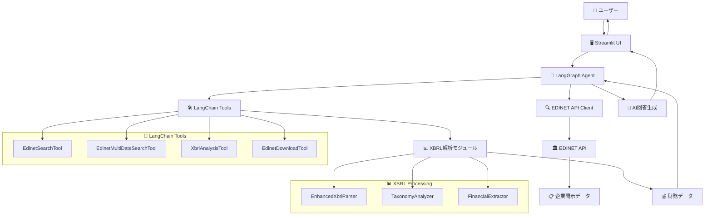

# EDINET財務分析システム

🔍 **日本企業の財務データを自然言語で簡単分析**

EDINET分析システムは、日本の金融庁が提供するEDINETシステムから財務データを自動取得し、AIエージェントが自然言語で分析結果を提供するWebアプリケーションです。

## ✨ 主な機能

### 🗣️ 自然言語での質問
```
「楽天グループの最新の総資産を教えてください」
「ソフトバンクグループの純利益を調べて」
「トヨタ自動車の財務状況を分析してください」
```

### 🔍 高度な検索機能
- **複数日付遡及検索**: 過去90日間から自動的に最新データを検索
- **企業名表記ゆれ対応**: 「楽天」→「楽天グループ株式会社」の自動変換
- **段階的検索**: 7日→30日→90日の効率的な検索戦略

### 🖥️ ユーザーフレンドリーなWebUI
- **リアルタイム処理状況表示**: 検索・分析の進捗をリアルタイム表示
- **詳細な結果表示**: 回答、参照書類、実行時間を表示
- **設定管理**: APIキー、モデル選択、メモリ機能の設定
- **会話継続**: メモリ機能による文脈を理解した対話

## 🚀 クイックスタート

### 1. 環境構築

```bash
# リポジトリのクローン
git clone <repository-url>
cd EdinetAnalyzer

# 依存関係のインストール
uv sync
```

### 2. APIキーの設定

```bash
# 環境変数の設定
export EDINET_API_KEY="your_edinet_api_key"
export OPENAI_API_KEY="your_openai_api_key"
```

または、Webアプリの設定画面で入力

### 3. アプリケーションの起動

```bash
uv run streamlit run src/edinet_analyzer/app.py
```

### 4. ブラウザでアクセス

http://localhost:8501

## 📋 前提条件

### 必須
- **EDINET APIキー**: [EDINET公式サイト](https://disclosure2.edinet-fsa.go.jp/)で登録
- **OpenAI APIキー**: [OpenAI公式サイト](https://openai.com/)で取得

### システム要件
- Python 3.12+
- インターネット接続

## 💡 使用例

### 基本的な使用方法

1. **Webアプリにアクセス**
2. **サイドバーでAPIキーを設定**
3. **質問を入力して「分析実行」をクリック**

### プログラムでの使用

```python
from src.edinet_analyzer import create_agent

# エージェント作成
agent = create_agent()

# 質問実行
result = agent.invoke("楽天グループの最新の総資産を教えてください")
print(result["final_answer"])
```

### 複数質問の例

```python
queries = [
    "楽天グループの最新の総資産を教えてください",
    "ソフトバンクグループの純利益を調べて", 
    "トヨタ自動車の財務状況を分析してください"
]

for query in queries:
    result = agent.invoke(query)
    print(f"質問: {query}")
    print(f"回答: {result['final_answer']}")
    print("-" * 50)
```

## 🏗️ システム構成



### 主要コンポーネント

1. **EDINET APIクライアント**: 金融庁APIとの通信
2. **XBRL解析モジュール**: 財務データの抽出・分析
3. **LangChainツール**: AIエージェントが使用可能な機能群
4. **LangGraphエージェント**: 自然言語質問応答のワークフロー
5. **StreamlitUI**: ユーザーインターフェース

## 🛠️ 技術スタック

### フロントエンド
- **Streamlit**: Webアプリケーション
- **Python**: メインプログラミング言語

### バックエンド
- **LangGraph**: AIエージェントワークフロー
- **LangChain**: AIツールチェーン
- **OpenAI GPT**: 自然言語処理

### データ処理
- **EDINET API**: 企業開示データ取得
- **edinet-xbrl**: XBRLデータ解析
- **Pandas**: データ処理

## 📂 プロジェクト構成

```
src/edinet_analyzer/
├── __init__.py                 # パッケージ初期化
├── agent.py                   # メインエージェント
├── state.py                   # 状態管理
├── nodes.py                   # ノード実装
├── edges.py                   # ルーティングロジック
├── app.py                     # Streamlitアプリ
├── tools/                     # 基盤ツール群
│   ├── edinet_api.py         # EDINET APIクライアント
│   ├── enhanced_xbrl_parser.py # 高度XBRL解析
│   ├── taxonomy_analyzer.py   # タクソノミ分析
│   ├── financial_mapping.py   # 財務データマッピング
│   └── financial_extractor.py # 財務データ抽出
└── langchain_tools/           # LangChainツール
    ├── edinet_search_tool.py  # EDINET検索ツール
    ├── edinet_multi_search_tool.py # 複数日付検索ツール
    └── xbrl_analysis_tool.py  # XBRL解析ツール

tests/                         # テストファイル群
docs/                         # ドキュメント
```

## 🔧 設定

### 環境変数

```bash
# 必須
export EDINET_API_KEY="your_edinet_api_key"
export OPENAI_API_KEY="your_openai_api_key"

# オプション
export DEFAULT_MODEL="gpt-4o"  # デフォルトモデル
```

### カスタマイズ

```python
# エージェント設定例
agent = create_agent(
    model_name="gpt-4o",           # 使用モデル
    enable_memory=True,            # メモリ機能
    api_key="custom_api_key"       # カスタムAPIキー
)
```

## 🚨 トラブルシューティング

### よくある問題

1. **APIキーエラー**
   - EDINET/OpenAI APIキーが正しく設定されているか確認
   - Webアプリの設定画面で再設定

2. **検索結果が見つからない**
   - 企業名の表記を確認（「楽天」→「楽天グループ」）
   - 複数日付検索が自動実行されているか確認

3. **起動エラー**
   - Python 3.12+がインストールされているか確認
   - `uv sync`で依存関係を再インストール

### ログ確認

```bash
# 詳細ログ表示でアプリ起動
uv run streamlit run src/edinet_analyzer/app.py --logger.level debug
```

## 📄 ライセンス

MIT License

